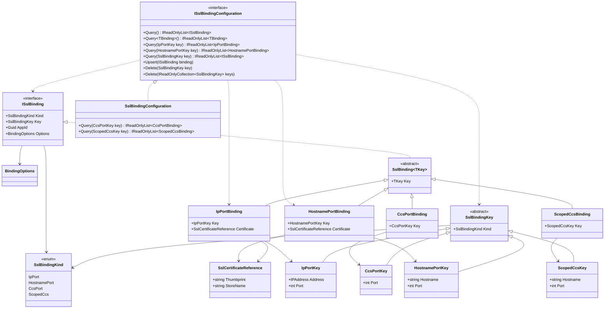
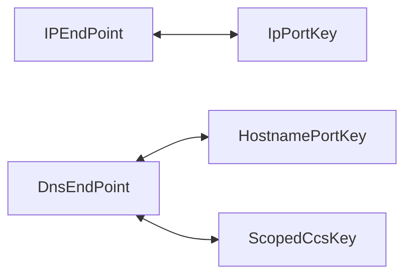
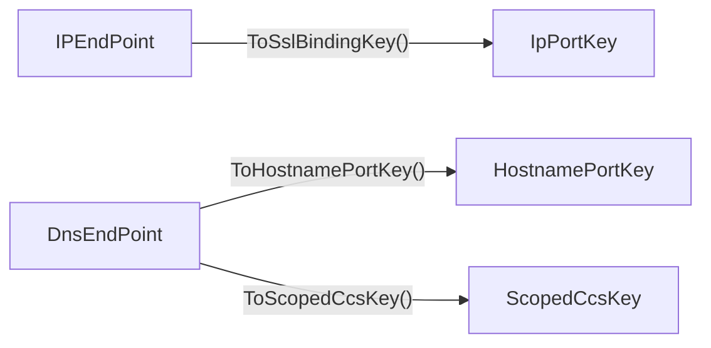

# Public API

This document is a snapshot of the currently shipped public API in `SslCertBinding.Net`.

It focuses on the API surface that exists today:

1. the generalized `ISslBinding` / `SslBinding<TKey>` model that supports `ipport` and `hostnameport`
2. the CCS and scoped CCS families exposed by the same model
3. the active non-obsolete configuration and binding types used by that model

`SslBindingConfiguration` also exposes concrete exact-query overloads for `CcsPortKey` and `ScopedCcsKey`. They are intentionally not part of `ISslBindingConfiguration`, which stays source/binary-compatible for downstream custom implementations.

`SslBindingKeyExtensions` is intentionally omitted from the diagram because it provides endpoint conversion helpers but does not change the core object model.

## Class Diagram



## Endpoint Conversions

The current API exposes two conversion styles between .NET endpoint types and binding-key types:

1. implicit conversion operators on `IpPortKey`, `HostnamePortKey`, and `ScopedCcsKey`
2. explicit endpoint conversion extension methods on `IPEndPoint` and `DnsEndPoint`

The operators support round-trip conversion between the matching endpoint and key types:



The extension methods support the endpoint-to-key direction when you want the call site to stay explicit about working with binding keys:



### Conversion Rules

1. `IPEndPoint` maps to `IpPortKey`.
2. `DnsEndPoint` maps to `HostnamePortKey` through `ToHostnamePortKey()`.
3. `DnsEndPoint` maps to `ScopedCcsKey` through `ToScopedCcsKey()`.
4. All endpoint conversion helpers return `null` when the input endpoint is `null`.

### Operator Examples

```csharp
IPEndPoint ipEndPoint = new IPEndPoint(IPAddress.Any, 443);
IpPortKey ipKey = ipEndPoint;
IPEndPoint roundTrippedIpEndPoint = ipKey;

DnsEndPoint dnsEndPoint = new DnsEndPoint("www.contoso.com", 443);
HostnamePortKey hostnameKey = dnsEndPoint;
DnsEndPoint roundTrippedDnsEndPoint = hostnameKey;

ScopedCcsKey scopedCcsKey = dnsEndPoint;
DnsEndPoint roundTrippedScopedDnsEndPoint = scopedCcsKey;
```

### Extension Method Examples

```csharp
IpPortKey ipKey = new IPEndPoint(IPAddress.Any, 443).ToSslBindingKey();
HostnamePortKey hostnameKey = new DnsEndPoint("www.contoso.com", 443).ToHostnamePortKey();
ScopedCcsKey scopedCcsKey = new DnsEndPoint("www.contoso.com", 443).ToScopedCcsKey();
```

### When To Use Which

1. Use the implicit operators when you want concise type-safe conversion between a concrete endpoint type and its matching concrete key type.
2. Use `ToSslBindingKey()`, `ToHostnamePortKey()`, or `ToScopedCcsKey()` when you want the code to read explicitly as a binding-key conversion at the call site.
3. Use the concrete key constructors or `From(...)` methods when that style is clearer for your codebase than either operators or extension methods.

## Scope Notes

1. This is a current-state API document, not a target-state design proposal.
2. The currently shipped generalized binding families are `IpPort`, `HostnamePort`, `CcsPort`, and `ScopedCcs`.
3. Only the IP and hostname families expose direct `SslCertificateReference` state.
4. `BindingOptions` support differs between the CCS families: `ScopedCcs` uses the shared option model, while `CcsPort` is currently limited to default options only.
5. Obsolete compatibility wrappers are intentionally excluded from this document so the diagram stays focused on the active contract for new code.
