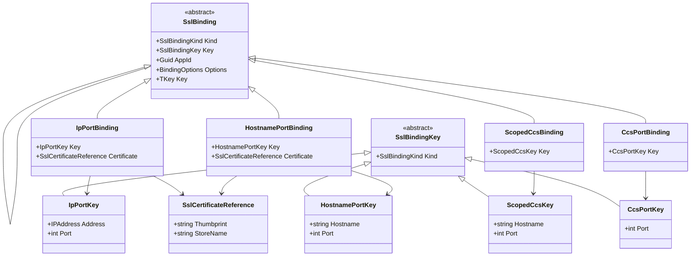

# SSL Binding Family Design

## Summary

`AnyHostPort` started as an attempt to make room for `netsh http add sslcert ccs=443`, but CCS is not just another endpoint shape. It is a different HTTP SSL binding family with different native configuration IDs and different key semantics.

## Implementation Status

The current implementation in this repository now ships the full binding-family surface described by this design.

Implemented now:

- new generalized `SslBindingConfiguration` supports `ipport`, `hostnameport`, `ccs`, and `scopedccs`
- the new public domain model currently includes:
  - `SslBindingKind`
  - `SslBindingKey`
  - `IpPortKey`
  - `HostnamePortKey`
  - `CcsPortKey`
  - `ScopedCcsKey`
  - `SslCertificateReference`
  - `ISslBinding`
  - `SslBinding<TKey>`
  - `IpPortBinding`
  - `HostnamePortBinding`
  - `CcsPortBinding`
  - `ScopedCcsBinding`
- CCS and scoped CCS HTTP API handlers
- nullable-reference annotations across the public surface

Still true from the earlier design draft:

- the binding-family model was the right abstraction
- `BindingEndPoint` / `AnyHostPort` would not have scaled cleanly to CCS
- the old IP-only surface remains only as obsolete compatibility wrappers

One small implementation detail differs from the earlier draft below: the shipped model now uses a hybrid interface/class model:

- `ISslBinding` is the non-generic root for mixed-family APIs
- `SslBinding<TKey>` adds a strongly typed `Key`
- the non-generic root still uses the same property name, `Key`, as `SslBindingKey`

That keeps mixed-family enumeration simple while removing duplicate key-property naming from the concrete binding types.

Another implementation detail changed from the earlier draft: the shipped API now keeps the old IP-only surface as obsolete compatibility wrappers. `CertificateBinding`, `ICertificateBindingConfiguration`, and `CertificateBindingConfiguration` remain available for existing callers, but they intentionally stay limited to `ipport` and do not expose hostname/SNI bindings.

The `support-sni` implementation is still useful as an implementation reference because it:

- extracts marshalling into dedicated interop helpers
- demonstrates how one additional HTTP SSL family can be added
- reduces the amount of native-code handling embedded directly in the configuration layer

But I would not continue extending the current public `BindingEndPoint` model to support:

- `add sslcert ipport=1.1.1.1:443`
- `add sslcert ipport=0.0.0.0:443`
- `add sslcert hostnameport=www.contoso.com:443`
- `add sslcert scopedccs=www.contoso.com:443`
- `add sslcert ccs=443`

The cleaner design is to model **binding family** explicitly and make endpoint-like values just one kind of binding key.

This document now serves mainly as design rationale for the shipped API. Some sections below still describe the rollout as stages because they explain how the current model was derived.

## Deep Reviewer Takeaway

The `deep_code_reviewer` run reached the same architectural conclusion:

- the current experimental implementation generalized around `BindingEndPoint`, but the next feature set is really about binding kind, not endpoint kind
- `AnyHostPort` is the wrong abstraction for CCS
- the branch’s reusable value is the internal interop extraction and SNI example, not the public endpoint hierarchy
- a cleaner implementation path is to start from `master`, pivot directly to a binding-family API, and add one native family at a time

## Why The Current Model Will Not Scale

### 1. `BindingEndPoint` conflates two different dimensions

In the current experimental implementation, `CertificateBinding` stores a `BindingEndPoint`, and `CertificateBindingConfiguration` routes mostly by whether the endpoint is `IpPort` or not:

- [BindingEndPoint.cs](/c:/Users/sgorodet/source/repos/SslCertBinding.Net/src/SslCertBinding.Net/BindingEndPoint.cs)
- [CertificateBinding.cs](/c:/Users/sgorodet/source/repos/SslCertBinding.Net/src/SslCertBinding.Net/CertificateBinding.cs)
- [CertificateBindingConfiguration.cs](/c:/Users/sgorodet/source/repos/SslCertBinding.Net/src/SslCertBinding.Net/CertificateBindingConfiguration.cs)

That works for two families:

- IP certificate bindings
- hostname/SNI certificate bindings

It breaks down as soon as we add:

- CCS bindings keyed by port only
- scoped CCS bindings keyed by host + port but belonging to a different native family than SNI

Two binding kinds can have the same apparent text shape and still be different families:

- `hostnameport=www.contoso.com:443`
- `scopedccs=www.contoso.com:443`

That alone is enough to show that endpoint shape is not the correct root abstraction.

### 2. `AnyHostPort` mixes wildcard IP with CCS semantics

`0.0.0.0:443` is a normal wildcard IP binding. `ccs=443` is not a wildcard IP binding; it is a CCS-family binding keyed by port.

The current `AnyHostPort` type tries to stand in for both ideas by being:

- parseable from a bare port
- convertible to `IPEndPoint`
- still part of the `BindingEndPoint` hierarchy

That makes the public API look simpler, but the underlying native semantics become harder to express correctly.

### 3. The current public API was generalized too early

Compared to the original `master` IP-only API, the implementation replaces the narrow surface with a generalized binding-family API. In the current codebase, the old IP-only surface remains available only as obsolete compatibility wrappers while the binding-family model is the primary public surface for new code.

## Recommended Design Direction

### Design Principle

Model the problem as:

- **What kind of binding is this?**
- **What key identifies it?**
- **What binding payload/configuration does it carry?**

Not as:

- **What kind of endpoint is this?**

## Recommended Public Domain Model

I recommend a new generalized API over `master`, with the generalized model becoming the primary public surface.

### Core Concepts

#### 1. `SslBindingKey`

Represents how a binding is identified for exact lookup and delete.

Proposed subtypes:

- `IpPortKey`
- `HostnamePortKey`
- `ScopedCcsKey`
- `CcsPortKey`

#### 2. `SslBinding`

Represents a full binding record returned from query and used for add/update.

Recommended shape:

- non-generic `SslBinding` for heterogeneous collections
- generic `SslBinding<TKey>` for concrete binding records

Proposed subtypes:

- `IpPortBinding`
- `HostnamePortBinding`
- `ScopedCcsBinding`
- `CcsPortBinding`

#### 3. `SslCertificateReference`

Represents direct certificate material for binding families that use a certificate hash and store.

Fields:

- `Thumbprint`
- `StoreName`

This belongs only on direct certificate bindings, not on CCS bindings.

#### 4. `BindingOptions`

Keep and reuse the existing `BindingOptions` type for the common SSL options that apply across binding families.

## Why This Is Better

This model avoids invalid states:

- `CcsPortBinding` does not need a fake `Host`
- `ScopedCcsBinding` is not confused with SNI just because both use `host:port`
- wildcard IP remains a normal `IpPortBindingKey` with `IPAddress.Any`
- CCS remains its own first-class family instead of being hidden inside `AnyHostPort`

## Proposed Types

### Binding Keys

- `IpPortKey`
  - `IPAddress Address`
  - `int Port`
  - Supports both `1.1.1.1:443` and `0.0.0.0:443`
  - Convertible to and from `IPEndPoint`

- `HostnamePortKey`
  - `string Hostname`
  - `int Port`
  - Convertible to and from `DnsEndPoint`

- `ScopedCcsKey`
  - `string Hostname`
  - `int Port`
  - Convertible to and from `DnsEndPoint`

- `CcsPortKey`
  - `int Port`

### Binding Records

- `IpPortBinding`
  - `IpPortKey Key`
  - `SslCertificateReference Certificate`
  - `Guid AppId`
  - `BindingOptions Options`

- `HostnamePortBinding`
  - `HostnamePortKey Key`
  - `SslCertificateReference Certificate`
  - `Guid AppId`
  - `BindingOptions Options`

- `ScopedCcsBinding`
  - `ScopedCcsKey Key`
  - `Guid AppId`
  - `BindingOptions Options`

- `CcsPortBinding`
  - `CcsPortKey Key`
  - `Guid AppId`
  - `BindingOptions Options`

## Class Diagrams

For the current shipped public API, including the standalone Mermaid diagram, see [public-api.md](/c:/Users/sgorodet/source/repos/SslCertBinding.Net/docs/public-api.md).

### Target Domain Model

The Mermaid diagram below is effectively the current shipped model.

1. The current code ships `IpPortKey`, `HostnamePortKey`, `CcsPortKey`, and `ScopedCcsKey`, along with `ISslBinding`, `SslBinding<TKey>`, all four concrete binding types, and `SslCertificateReference`.
2. The current code also keeps `CertificateBinding`, `ICertificateBindingConfiguration`, and `CertificateBindingConfiguration` as obsolete IP-only compatibility wrappers.
3. `SslCertificateReference` now uses a strict non-null store-name contract for explicit store names; callers use the one-argument overload when they want the default `MY` store.



## Native Mapping Table

| Netsh shape | Recommended key type | Recommended binding type | HTTP API family |
| --- | --- | --- | --- |
| `ipport=1.1.1.1:443` | `IpPortKey` | `IpPortBinding` | `HttpServiceConfigSSLCertInfo` |
| `ipport=0.0.0.0:443` | `IpPortKey` | `IpPortBinding` | `HttpServiceConfigSSLCertInfo` |
| `hostnameport=www.contoso.com:443` | `HostnamePortKey` | `HostnamePortBinding` | `HttpServiceConfigSslSniCertInfo` |
| `scopedccs=www.contoso.com:443` | `ScopedCcsKey` | `ScopedCcsBinding` | `HttpServiceConfigSslScopedCcsCertInfo` |
| `ccs=443` | `CcsPortKey` | `CcsPortBinding` | `HttpServiceConfigSslCcsCertInfo` |

## API Recommendation

### New Generalized API

```csharp
public interface ISslBindingConfiguration
{
    IReadOnlyList<ISslBinding> Query();
    IReadOnlyList<TBinding> Query<TBinding>() where TBinding : ISslBinding;
    IpPortBinding? Find(IpPortKey key);
    HostnamePortBinding? Find(HostnamePortKey key);
    CcsPortBinding? Find(CcsPortKey key);
    ScopedCcsBinding? Find(ScopedCcsKey key);
    ISslBinding? Find(SslBindingKey key);
    void Upsert(ISslBinding binding);
    void Delete(SslBindingKey key);
    void Delete(IReadOnlyCollection<SslBindingKey> keys);
}
```

Typed `Find(...)` overloads let callers avoid casts for exact lookup, while `Query<TBinding>()` provides family-specific enumeration without adding one method per binding family.

In the shipped API, `Find(...)` follows a "get or null" contract rather than a `TryFind(...)` pattern.

## Implementation Strategy Over `master`

This is the recommended delivery plan if the feature is built starting from `master`.

### Guiding rules

- replace the current `master` IP-only public API with the binding-family API in the next major version
- treat `support-sni` as a reference implementation, not as the public design baseline
- add one native binding family at a time, with tests and `netsh` helper support before moving on

### Recommended path

1. Start from `master`.
2. Add the generalized binding-family API.
3. Port over the good internal ideas from `support-sni`:
   - `BindingStructures`
   - `SockaddrStructure`
   - generic query/bind/delete helpers
4. Implement handlers one family at a time:
   - IP first
   - hostname/SNI second
   - CCS third
   - scoped CCS fourth
5. Add integration tests and `netsh` helper support for each family explicitly.

## Suggested Implementation Stages

### Stage 0: Prepare `master` for extension

Goals:

- create internal seams for future binding families

Work:

- extract shared native call orchestration from the current IP-only implementation
- introduce internal marshalling helpers inspired by `support-sni`
- add regression tests around the new generalized surface before later families are added

Deliverable:

- cleaner internal structure ready for multiple binding handlers

### Stage 1: Introduce the generalized domain model

Goals:

- add the long-term public model

Work:

- add `SslBindingKind`
- add `SslBindingKey` and concrete key types
- add `SslBinding` and concrete binding record types
- add conversions to/from `IPEndPoint` and `DnsEndPoint`
- add type-specific `Parse`, `TryParse`, and `ToString()`

Deliverable:

- new generalized API types exist

### Stage 2: Re-implement IP bindings on top of the new model

Goals:

- prove the new architecture can support the IP family cleanly

Work:

- implement `IpPortKey`
- implement `IpPortBinding`
- implement `IpPortBindingHandler`

Deliverable:

- new generalized API can query, bind, and delete `ipport` records

### Stage 3: Add hostname/SNI bindings

Goals:

- extend the system with the first non-IP family

Work:

- implement `HostnamePortKey`
- implement `HostnamePortBinding`
- implement `HostnamePortBindingHandler`
- add SNI-specific query, bind, and delete tests
- extend the `netsh` helper to support `hostnameport`

Deliverable:

- the generalized API supports:
  - `ipport=1.1.1.1:443`
  - `ipport=0.0.0.0:443`
  - `hostnameport=www.contoso.com:443`

### Stage 4: Add CCS bindings

Goals:

- model port-only CCS explicitly without forcing it through endpoint abstractions

Work:

- implement `CcsPortKey`
- implement `CcsPortBinding`
- implement `CcsPortBindingHandler`
- add `netsh` helper support for `ccs`
- add exact lookup, enumeration, bind, and delete tests for `ccs=443`

Deliverable:

- the generalized API supports `ccs=443`
- no `AnyHostPort`-style endpoint workaround is required

### Stage 5: Add scoped CCS bindings

Goals:

- support host+port CCS while keeping it distinct from SNI

Work:

- verify the exact native structure and marshalling requirements for `HttpServiceConfigSslScopedCcsCertInfo`
- implement `ScopedCcsKey`
- implement `ScopedCcsBinding`
- implement `ScopedCcsBindingHandler`
- add `netsh` helper support for `scopedccs`
- add exact lookup, enumeration, bind, and delete tests for `scopedccs=www.contoso.com:443`

Deliverable:

- the generalized API supports `scopedccs=www.contoso.com:443`
- `HostnamePortKey` and `ScopedCcsKey` remain separate public concepts even though both use `host:port`

### Stage 6: Migration and cleanup

Goals:

- finish the rollout cleanly once all binding families are stable

Work:

- update README and sample code to prefer the new generalized API
- document the remaining gap to CCS and scoped CCS
- decide whether any additional convenience overloads are needed before CCS work starts

Deliverable:

- stable documentation
- clear next-stage guidance
- intentional major-version API plan

### Why I would not continue from the current public model

- `BindingEndPoint` is not the correct root abstraction once CCS exists.
- `AnyHostPort` encourages the wrong mental model for `ccs=443`.
- `host:port` alone cannot distinguish SNI from scoped CCS.
- extending the current public hierarchy will likely require another public redesign later.

## What To Reuse From `support-sni`

Keep:

- interop extraction into dedicated helper classes
- generic query/bind/delete orchestration
- SNI marshalling patterns
- improved tests around endpoint parsing where still applicable

Do not keep as the long-term public root model:

- `BindingEndPoint` as the top-level generalized concept
- `AnyHostPort` as the placeholder for CCS
- routing logic that decides binding family from endpoint subtype alone

## Implementation Notes

### Parsing

Parsing should be a convenience layer, not the discriminator.

Examples:

- `IpPortKey.Parse("1.1.1.1:443")`
- `IpPortKey.Parse("0.0.0.0:443")`
- `HostnamePortKey.Parse("www.contoso.com:443")`
- `ScopedCcsKey.Parse("www.contoso.com:443")`
- `CcsPortKey.Parse("443")`

This avoids ambiguous parsing where the same text shape maps to different binding families.

### Why this naming is better

The earlier names `IpPortBindingKey` and `CcsPortBindingKey` made the types feel like wrappers around a single transport primitive. The revised names are intended to read more like domain identifiers:

- `IpPortKey` is explicitly the key for the IP binding family, with `Address` and `Port` exposed directly
- `CcsPortKey` is explicitly the key for the CCS binding family, whose identity really is just the port

That still leaves `CcsPortKey` with a single property, but in this case that is acceptable because the native key itself is genuinely port-only. The important part is that the type name now conveys binding family semantics, not just data shape.

## .NET Type Conversions

The binding keys should interoperate with existing .NET networking types wherever the mapping is natural.

### Recommended conversion rules

- `IpPortKey` <-> `IPEndPoint`
- `HostnamePortKey` <-> `DnsEndPoint`
- `ScopedCcsKey` <-> `DnsEndPoint`
- `CcsPortKey`
  - no direct `EndPoint` equivalent in .NET
  - stays port-only by design

This gives callers a familiar entry point while still keeping binding family explicit.

### Recommended API shape

#### `IpPortKey`

```csharp
public sealed class IpPortKey : SslBindingKey
{
    public IPAddress Address { get; }
    public int Port { get; }

    public IpPortKey(IPAddress address, int port);
    public IpPortKey(IPEndPoint endPoint);

    public IPEndPoint ToIPEndPoint();

    public static IpPortKey From(IPEndPoint endPoint);
    public static implicit operator IpPortKey(IPEndPoint endPoint);
    public static implicit operator IPEndPoint(IpPortKey key);
}
```

#### `HostnamePortKey`

```csharp
public sealed class HostnamePortKey : SslBindingKey
{
    public string Hostname { get; }
    public int Port { get; }

    public HostnamePortKey(string hostname, int port);
    public HostnamePortKey(DnsEndPoint endPoint);

    public DnsEndPoint ToDnsEndPoint();

    public static HostnamePortKey From(DnsEndPoint endPoint);
    public static implicit operator HostnamePortKey(DnsEndPoint endPoint);
    public static implicit operator DnsEndPoint(HostnamePortKey key);
}
```

#### `ScopedCcsKey`

```csharp
public sealed class ScopedCcsKey : SslBindingKey
{
    public string Hostname { get; }
    public int Port { get; }

    public ScopedCcsKey(string hostname, int port);
    public ScopedCcsKey(DnsEndPoint endPoint);

    public DnsEndPoint ToDnsEndPoint();

    public static ScopedCcsKey From(DnsEndPoint endPoint);
    public static implicit operator ScopedCcsKey(DnsEndPoint endPoint);
    public static implicit operator DnsEndPoint(ScopedCcsKey key);
}
```

#### `CcsPortKey`

```csharp
public sealed class CcsPortKey : SslBindingKey
{
    public int Port { get; }

    public CcsPortKey(int port);
}
```

### Why conversions belong on the key types

Putting the conversions on the binding keys keeps the public API ergonomic without making .NET endpoint types the primary domain model again.

That gives us:

- familiar construction from `IPEndPoint` and `DnsEndPoint`
- explicit selection of binding family
- no ambiguity between `hostnameport` and `scopedccs`
- no pressure to force `ccs=443` into a fake `EndPoint`

### Important nuance

`DnsEndPoint` can map to either:

- `HostnamePortKey`
- `ScopedCcsKey`

So the conversion should be type-specific rather than generic. In other words:

- `new HostnamePortKey(dnsEndPoint)` is valid
- `new ScopedCcsKey(dnsEndPoint)` is valid
- a generic `SslBindingKey.From(DnsEndPoint)` is not recommended because it loses binding-family intent

## Parsing And `ToString()`

Parsing and formatting should be part of the concrete key types.

They are important for:

- round-trip behavior
- test readability
- `netsh` integration helpers
- migration from the current `BindingEndPoint` API

But they should not erase binding-family intent.

### Recommended rule

- each concrete key type owns `Parse`, `TryParse`, and `ToString()`
- the abstract base should not expose a generic `Parse(string)` method
- if a generic parser exists at all, it should require an explicit `SslBindingKind`

### Recommended API shape

#### `IpPortKey`

```csharp
public sealed class IpPortKey : SslBindingKey
{
    public static IpPortKey Parse(string value);
    public static bool TryParse(string value, out IpPortKey key);
    public override string ToString();
}
```

Accepted forms:

- `1.1.1.1:443`
- `0.0.0.0:443`
- `[::]:443`
- `[2001:db8::1]:443`

Canonical `ToString()` output:

- IPv4: `1.1.1.1:443`
- IPv6: `[2001:db8::1]:443`

#### `HostnamePortKey`

```csharp
public sealed class HostnamePortKey : SslBindingKey
{
    public static HostnamePortKey Parse(string value);
    public static bool TryParse(string value, out HostnamePortKey key);
    public override string ToString();
}
```

Accepted form:

- `www.contoso.com:443`

Canonical `ToString()` output:

- `www.contoso.com:443`

#### `ScopedCcsKey`

```csharp
public sealed class ScopedCcsKey : SslBindingKey
{
    public static ScopedCcsKey Parse(string value);
    public static bool TryParse(string value, out ScopedCcsKey key);
    public override string ToString();
}
```

Accepted form:

- `www.contoso.com:443`

Canonical `ToString()` output:

- `www.contoso.com:443`

#### `CcsPortKey`

```csharp
public sealed class CcsPortKey : SslBindingKey
{
    public static CcsPortKey Parse(string value);
    public static bool TryParse(string value, out CcsPortKey key);
    public override string ToString();
}
```

Accepted form:

- `443`

Canonical `ToString()` output:

- `443`

### Why parsing should be type-specific

The text alone is not always enough to determine binding family:

- `www.contoso.com:443` can mean `hostnameport` or `scopedccs`
- `443` is not a generic endpoint; it is specifically a CCS binding key

Because of that, this is recommended:

- `HostnamePortKey.Parse("www.contoso.com:443")`
- `ScopedCcsKey.Parse("www.contoso.com:443")`
- `CcsPortKey.Parse("443")`

And this is not recommended:

- `SslBindingKey.Parse("www.contoso.com:443")`

### Optional generic parser

If a generic parser is useful for CLI or test code, it should require the binding family explicitly:

```csharp
public static SslBindingKey Parse(string value, SslBindingKind kind);
public static bool TryParse(string value, SslBindingKind kind, out SslBindingKey key);
```

That keeps ambiguity out of the public model while still supporting convenience scenarios.

### `ToString()` semantics

`ToString()` should return the canonical key payload, not the full `netsh` command argument name.

Examples:

- `new IpPortKey(IPAddress.Parse("1.1.1.1"), 443).ToString()` -> `1.1.1.1:443`
- `new IpPortKey(IPAddress.IPv6Any, 443).ToString()` -> `[::]:443`
- `new HostnamePortKey("www.contoso.com", 443).ToString()` -> `www.contoso.com:443`
- `new ScopedCcsKey("www.contoso.com", 443).ToString()` -> `www.contoso.com:443`
- `new CcsPortKey(443).ToString()` -> `443`

The binding-family-specific prefix belongs elsewhere:

- `ipport=` + key
- `hostnameport=` + key
- `scopedccs=` + key
- `ccs=` + key

That separation keeps the domain types reusable outside of `netsh`.

### Testing

The test harness should grow family-by-family rather than assuming only `ipport` and `hostnameport`.

Recommended additions:

- exact lookup/add/delete tests for each binding family
- `netsh` helper support for `ccs` and `scopedccs`
- round-trip tests for each native family

## Final Recommendation

If this feature is going to be implemented now, this document should be treated as the target design over `master`, not as a refinement of `support-sni`.

Recommended sequence:

1. introduce the new binding-family model
2. re-implement IP on top of it
3. add SNI
4. add CCS
5. add scoped CCS
6. finish migration and documentation

If implementation work borrows from `support-sni`, I would still pivot the public design away from `BindingEndPoint` before adding CCS support. `support-sni` is a good example of how to structure the interop internals, but not a strong long-term public model for all five binding kinds.
